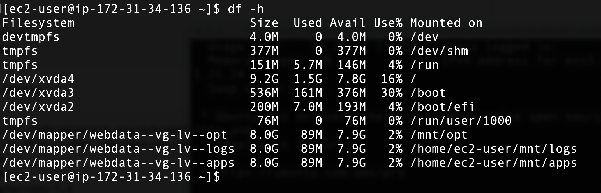
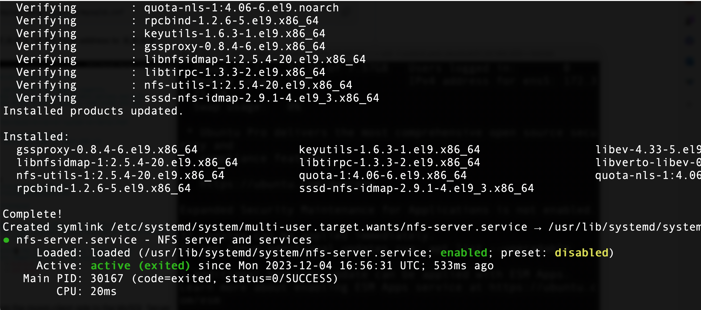
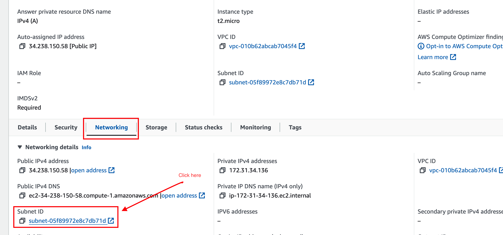
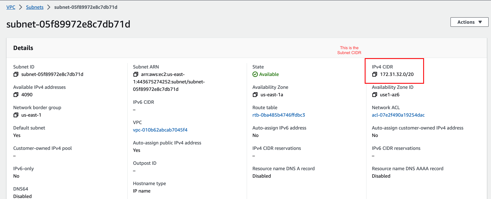
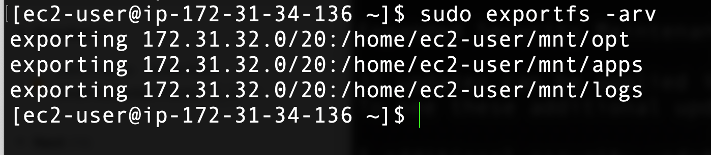
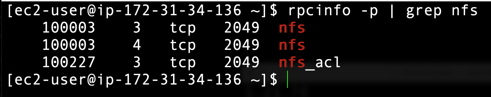
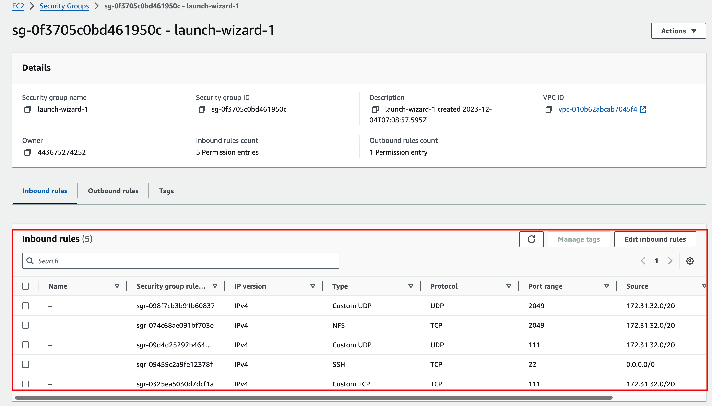
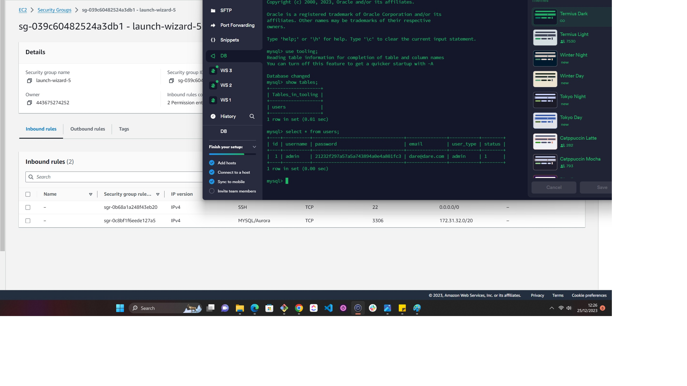
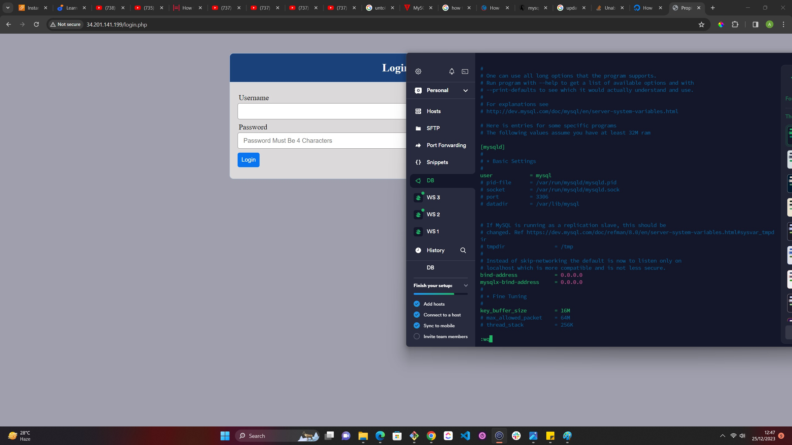
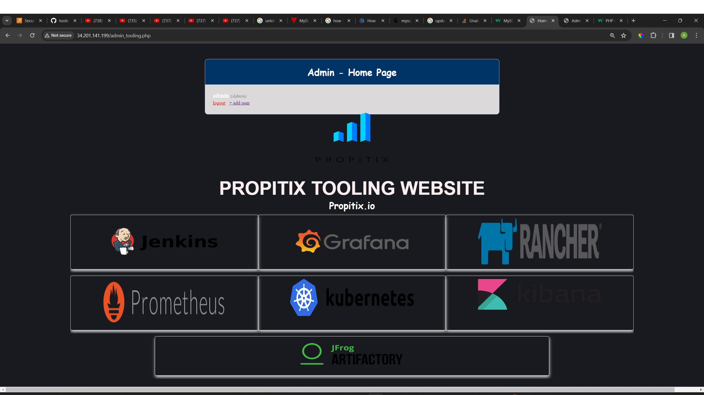

# Implementing a business website using NFS (Network File System) for the backend file storage

In this project, we will be implementing a website using NFS as our file storage.

Spin up an EC2 instance with RedHat 9 OS and configure LVM. 

Refresher to create LVM

Create 3 storage volumes using Amazon EBS (Elastic Block Store) of 10GB each in the same Avalability Zone (AZ) with the EC2 RedHat instance.

Instead of formating the disc as `ext4` we will be using `xfs`

And the 3 logical volumes will be `lv-opt`, `lv-apps` and `lv-logs`

The result of the mounting is as follow



### Install NFS server configure it to start on reboot and up and running

```
sudo yum -y update
sudo yum install nfs-utils -y
sudo systemctl start nfs-server.service
sudo systemctl enable nfs-server.service
sudo systemctl status nfs-server.service
```

The above code will install NFS, reboot, enable it to ensure the service is running



> Export the mount for the webserver's `subnet cidr` to connect as clients.

For simplicity, we will install all 3 webservers in the same subnet, but in production, we would want each seperate tier inside it's own subnet to obtain a higher level of security.

To check your `subnet cidr` on your EC2 instance web console, locate `Networking tab` and open a subnet link





>NB: Kindly ensure to setup permission for our Webservers to read, write and execute on the NFS using the command below

```
sudo chown -R nobody: mnt/apps
sudo chown -R nobody: mnt/logs
sudo chown -R nobody: mnt/opt
sudo chmod -R 777 mnt/apps
sudo chmod -R 777 mnt/logs
sudo chmod -R 777 mnt/opt
sudo systemctl restart nfs-server.service
```

> Configure access to NFS for clients with the same subnet E.g 172.31.32.0/20
 
```
sudo vi /etc/exports

/mnt/apps <Subnet-CIDR>(rw,sync,no_all_squash,no_root_squash)
/mnt/logs <Subnet-CIDR>(rw,sync,no_all_squash,no_root_squash)
/mnt/opt <Subnet-CIDR>(rw,sync,no_all_squash,no_root_squash)

Esc + :wq!

sudo exportfs -arv

```



Next is to check the port used by NFS and open the port 

rpcinfo -p | grep nfs




> NB: In other for the NFS server to be accesible from the clients, you must also open the following ports

TCP: 111

UDP: 111

UDP: 2049 and TCP: 2049




# Configure backend databases as part of the 3 tier Architecture

Let us install and configure a mySQL server to work with Webserver

1. Install mysql server
2. Create a database and name it `tooling`
3. Create a database user and name it `webaccess`

Grant permission to `webaccess` user on the `tooling` DB to do anything only on the subnet CIDR (172.31.32.0/20) in this case.

##### Output


### Prepare the Webservers

We need to make sure our webservers can serve the same content from the shared storage solution in our case. NFS Server and MySQL DB. You already know that one DB can be accessed for reads and writes by multiple clients. For storing shared files that our Web Servers will use - we will utilize NFS and mount reviouslt created LVs `(lv-apps)` to the folder where Apache stores files to be served to the user `(/var/www)`


This approach will make our Webservers (Stateless), which means we will be able to add new ones or remove them when needed and the integrity of the data (in the DB and NFS) will be preserved 


Let's the following:

1. Configure NFS client (This will be done on all 3 servers)
2. Deploy a Tooling application to our webservers into a shared NFS folder
3. Configute the webservers to work with a single MySQL DB

1.1 Launch a new EC2 instane with RHEL 8/9 OS
2.1 Install NFS client

```
sudo yum install nfs-utils nfs4-acl-tools -y
```

3. Mount /var/www and target the NFS server's export for apps

```
sudo mkdir /var/www
sudo mount -t nfs -o rw,nosuid <NFS-Server-Private-IP-Address>:/mnt/apps /var/www
```

Verify that NFS was mounted successfully by running `df -h`. Make sure that the changes will persist on a web server reboot by running the following 

```
sudo vi /etc/fstab
```

and add the following line

```
<NFS-Server-Private-IP-Address>:/mnt/apps /var/www nfs defaults 0 0
```

##### Output





#### 5. Install Apache and PHP using the Remi's Repo https://github.com/darey-io/tooling


The following code will be used to install the Remi's Repo that contains the some PHP installation

```
sudo yum install httpd -y

sudo dnf install https://dl.fedoraproject.org/pub/epel/epel-release-latest-8.noarch.rpm

sudo dnf install dnf-utils http://rpms.remirepo.net/enterprise/remi-release-8.rpm

sudo dnf module reset php

sudo dnf module enable php:remi-7.4

sudo dnf install php php-opcache php-gd php-curl php-mysqlnd

sudo systemctl start php-fpm

sudo systemctl enable php-fpm

setsebool -P httpd_execmem 1
```

Verify that Apache files and directories are available on the WebServers in /var/www and also in the NFS server in /mnt/apps. If you see the same files, it means thatNFS is mounted correctly. You can do that by creating a sample file touch sampe.txt from one server and check if it exists or accessible from other WebServers.

7. Locate the log folder for Apache on the Webs erver and miunt it to the NFS server's export for logs. Repeat 3 above to ensure the change is persistence after a reboot.

8. Fork tooling source code from https://github.com/darey-io/tooling

9. Deploy the tooling website ocde to the webserver. Ensure html folder from the repo is deployed to /var/www/html (by replacing the default with the one from the repo).

> Do not forget to open port 80 on the web server

> If you encounter 403 error, check permission for /var/www/html folder and disable SELinux `sudo setenforce 0`

Open the config file 

```
sudo vi /etc/sysconfig/selinux 
```
and set SELINUX=disabled


then restart httpd

`sudo systemctl restart httpd`

>NB: Don't forget to bind address on the DB server when you get error such as Can't connect to Host... Error 111




#### 10. Update the website configuration 


Update the website configuration to connect to the DB in `/var/www/html/functions.php` file. Apply tooling-bd.sql script to your database using the command

```
sudo mysql -h <database-private-ip> -u <db-username> -p < tooling-db.sql
```

11. Create in MySQL a new admin user with username: username and password: password

```
INSERT INTO 'users' ('id', 'username', 'password', 'email', 'user_type', 'status') VALUES
-> (1, 'myuser', '5f4dcc3b5aa765d61d8327deb882cf99', 'user@mail.com', 'admin', '1');
```

12. Open in the webbrowser `http://<website-public-ip/index.php`




